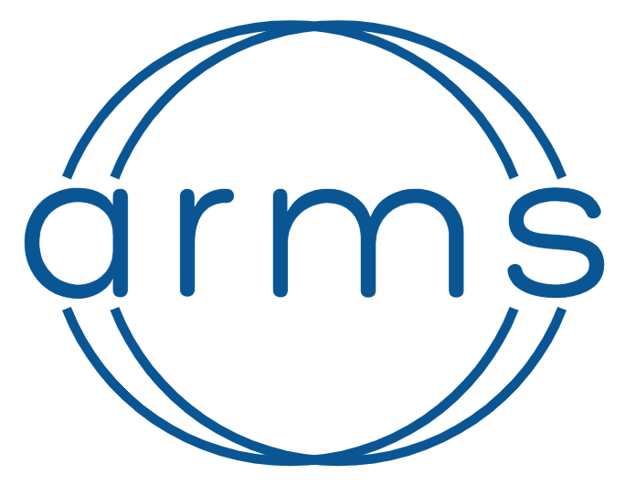

<!-- README.md is generated from README.Rmd. Please edit that file -->
<!-- badges: start -->

[](https://github.com/OJWatson/arms/actions)
[](https://www.codefactor.io/repository/github/OJWatson/arms)
[](https://codecov.io/github/OJWatson/arms?branch=main)
[](https://github.com/afyac/mast/actions/workflows/R-CMD-check.yaml)
<!-- badges: end -->

## 

## Artemisinin resistance modelling via selection

### Installation

To install `arms`:

``` r
remotes::install_github("OJWatson/arms", upgrade = FALSE)
```

#### Licenses

Code: [MIT](http://opensource.org/licenses/MIT) year: 2023, copyright
holder: OJ Watson

Data: [CC-0](http://creativecommons.org/publicdomain/zero/1.0/)
attribution requested in reuse
