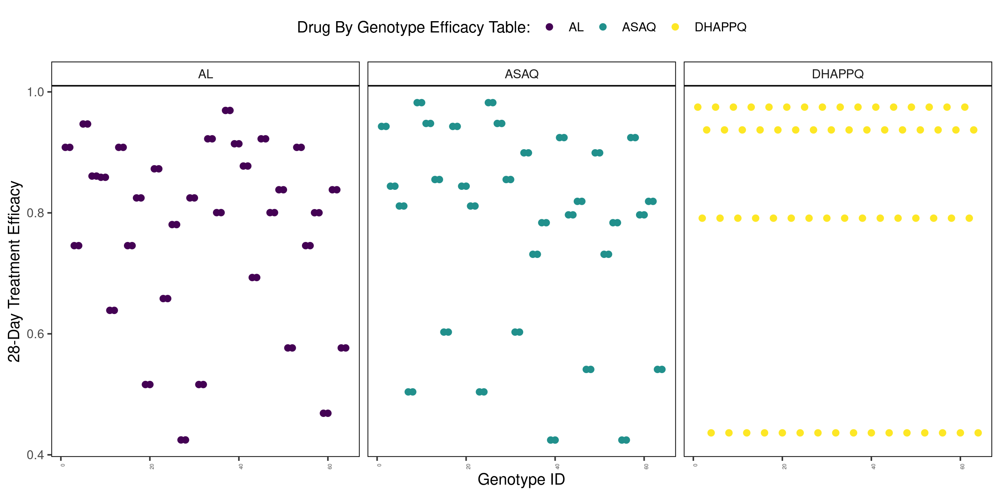

## File/Data Description

The `data_out` directory contains modelled outputs for external partners at the first administrative unit.

### Modelled risk outputs

The first set of outputs provide the estimated time that artemisinin resistance (ArtR) will increase from 1% to 10%, with assumed starting partner drug resistance equal to 1%. Where times are predicted to take longer than 40 years, these have been censored ("\>40"):

1.  `central_times.csv`
2.  `optimistic_times.csv`
3.  `pessimistic_times.csv`

We also output the longitudinal time series for ArtR and 28-day treatment failure at each year from t = 0 to t = 40 years.

1.  `central_longitudinal_times.csv`
2.  `optimistic_longitudinal_times.csv`
3.  `pessimistic_longitudinal_times.csv`

The second set of outputs provide the estimated time from now (based on spatial maps of current resistance prevalence) for ArtR to reach 10%.

Similarly to before, where times are predicted to take longer than 40 years, these have been censored ("\>40"):

1.  `central_times_prospective.csv`
2.  `optimistic_times_prospective.csv`\
3.  `pessimistic_times_prospective.csv`

We also output the longitudinal time series for ArtR and 28-day treatment failure at each year from t = 0 to t = 40 years for these prospective simulations.

1.  `central_longitudinal_times_prospective.csv`
2.  `optimistic_longitudinal_times_prospective.csv`\
3.  `pessimistic_longitudinal_times_prospective.csv`

In all the outputs above, the **central** times provide the estimated times based on the central parameter estimate for each of the parameters that we explored and that are known to impact the speed of selection of ArtR (malaria prevalence, treatment related parameters, current resistance prevalence, types of ACT in use).

The **optimistic** times assume the upper or lower estimate value for each parameter (depending on the direction of its effect on selection) such that the selection of ArtR will increase at its slowest. Conversely, the **pessimistic** times assume the upper or lower value for each parameter (depending on the direction of its effect on selection) such that the selection of ArtR will increase at its fastest.

The uncertainty provided in each of the files, reflects the uncertainty that arises from our use of a stochastic, individual based model for the selection of ArtR.

Lastly, in the longitudinal outputs, **artR\_** is the frequency of artemisinin resistance overtime and **tf\_** is average treatment failure over time. Note that treatment failure does not start at 0% at the beginning of simulations, even if there is minimal resistance, because each ACT is a not perfectly curative (i.e. treatment of wild type parasites still has an 2-4% 28-day treatment failure rate, depending on the ACT used).

### Higher Resistance Phenotype Simulations

In addition to the files described above, there are outputs that reflect similar simulations but using a different assumption about the relationship between resistance genotypes and the resistance phenotype. In these, we assume that lumefantrine and amodaquine resistance will become worse than what has already been observed, such that the maximum and minimum efficacy for AL and ASAQ is equal to DHA-PPQ. This was an approach previously used in [Watson et al. 2022. Lancet Microbe. Supp Figure 18](https://www.thelancet.com/journals/lanmic/article/PIIS2666-5247(22)00155-0/fulltext) and shown below. The results of using this higher resistance relationship are in the outputs files with `_higher_res` in the file name.

### Shape Files

The linked shape files for these outputs are in `shape_files/`. The admin level 0 and admin level 1 shape files are provided, both as a saved R object (`.rds`) and as a shape file (`.shp`). To link these with the risk outputs, these can be matched using `id_1`.
